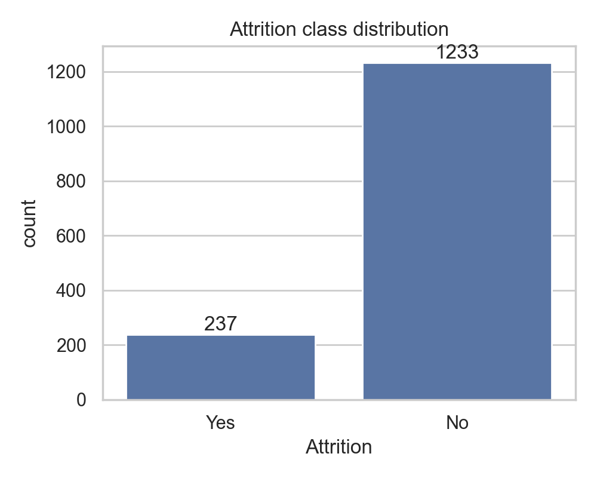
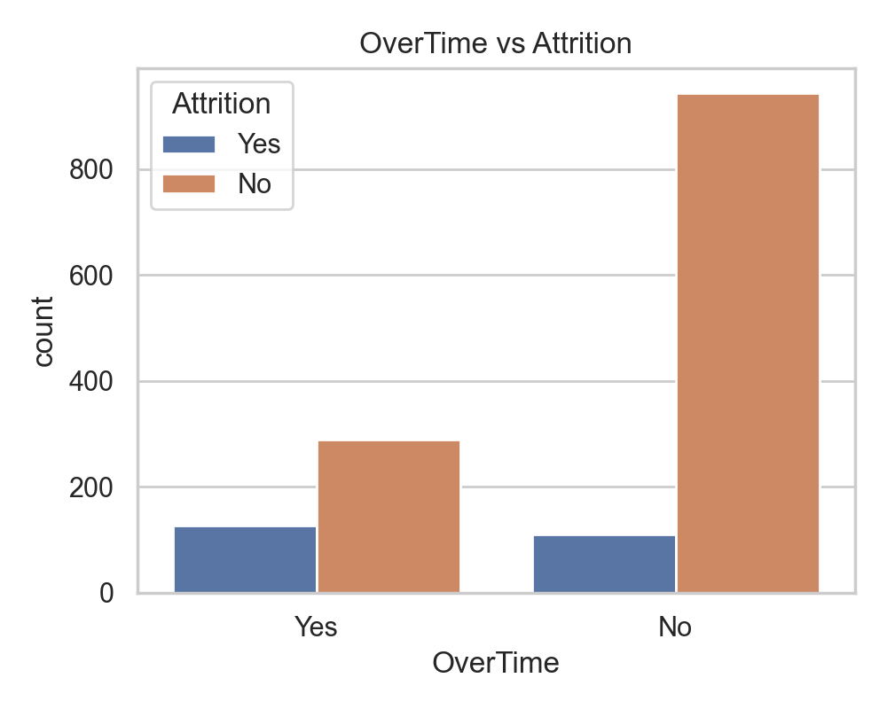
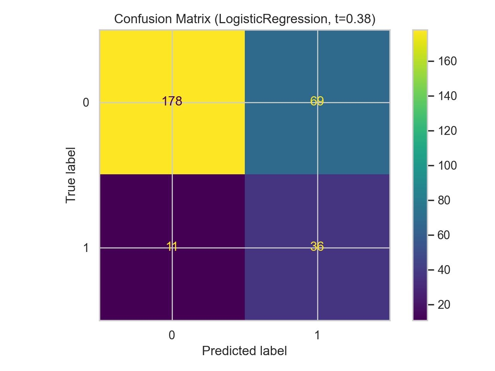
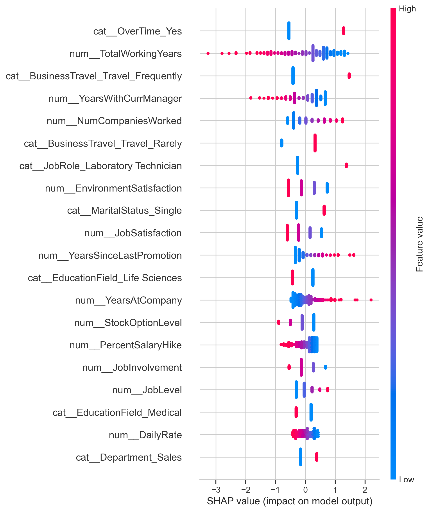

# Employee Attrition Prediction (High-Recall) + SHAP Drivers

**Objective:** Predict employee attrition (binary classification) and prioritize **high recall** for attrition cases (minimize missed flight-risk employees). Provide **global and individual explanations** of the main drivers using SHAP.

## Dataset
- **Source:** IBM HR Analytics Employee Attrition & Performance (Kaggle)
- Put the CSV at: `data/HR-Employee-Attrition.csv`
  - (If your download name is `WA_Fn-UseC_-HR-Employee-Attrition.csv`, rename it to `HR-Employee-Attrition.csv`.)

## Project structure
```
employee-attrition-prediction/
├── data/
│   └── HR-Employee-Attrition.csv
├── src/
│   ├── eda.py                   # generates EDA figures
│   └── train.py                 # trains models + SHAP + exports artifacts
├── reports/
│   └── figures/                 # generated figures (EDA, CM, SHAP, etc.)
├── app/
│   └── streamlit_app.py
├── models/
│   ├── attrition_pipeline.pkl   # exported best pipeline (preprocess + model)
│   ├── threshold.json           # chosen probability threshold for high recall
│   └── schema.json              # input schema (columns + categories) for Streamlit
├── README.md
└── requirements.txt
```

## Quickstart
1. Install dependencies
   ```bash
   pip install -r requirements.txt
   ```
2. Run EDA (generates figures into `reports/figures/`)
   ```bash
   python src/eda.py
   ```
3. Train + evaluate + SHAP + export model artifacts into `models/`
   ```bash
   python src/train.py --target-recall 0.80
   ```
4. (Optional) Run the Streamlit app after training exports the model:
   ```bash
   streamlit run app/streamlit_app.py
   ```

## EDA (what to screenshot for GitHub / resume)
The EDA script generates plots into `reports/figures/` (so you can embed them here).

Suggested visuals:
- Attrition rate (class imbalance)
- Attrition by Department / JobRole / MaritalStatus / Gender
- Distributions: Age, MonthlyIncome, DistanceFromHome, YearsAtCompany
- Confusion matrix at the chosen high-recall threshold
- SHAP summary plot (top global drivers)

Placeholders (these will exist after running the notebook):
<!--




-->

## Modeling approach (high recall)
We compare three models using **Stratified K-Fold** cross-validation and **recall** as the primary metric:
- Logistic Regression (interpretable baseline)
- Random Forest
- XGBoost

### Leakage-safe preprocessing
All preprocessing is done inside an **imblearn Pipeline**:
- Drop constant/ID columns: `EmployeeNumber`, `EmployeeCount`, `Over18`, `StandardHours`
- Numeric: median imputation + standard scaling
- Categorical: most-frequent imputation + one-hot encoding (`handle_unknown="ignore"`)
- Imbalance handling: **SMOTE on training folds only**

### Threshold tuning
Instead of using the default 0.5 cutoff, we **choose a probability threshold** to hit a target recall (e.g., **≥ 0.80**) and then maximize precision/F1 under that constraint.

## Interpretability (SHAP)
The training script computes:
- **SHAP summary plot** (global drivers)
- Example **single-employee explanation** (local drivers)

Typical high-impact drivers you can discuss:
- OverTime
- MonthlyIncome
- StockOptionLevel
- JobInvolvement / EnvironmentSatisfaction
- YearsSinceLastPromotion / YearsInCurrentRole

## Business translation (example calculation)
If a company has 5,000 employees and ~16% annual attrition, that’s ~800 leavers/year.
If replacement cost ≈ 1.5× salary and average salary is $60k:
- Replacement cost per leaver ≈ $90k
- If a high-recall model flags 85% of leavers and HR retains 20% of those flagged:
  - Retained ≈ 800 × 0.85 × 0.20 = 136 employees
  - Savings ≈ 136 × $90k = **$12.24M**

## Notes on responsible use
- This is a decision-support tool. Predictions should be combined with HR policy and human review.
- In production, add monitoring, drift detection, periodic retraining, and fairness checks (e.g., error rates across protected groups).

## Resume bullets (copy/paste)
**Employee Attrition Prediction & Retention Strategy** — Python, Scikit-learn, XGBoost, SHAP, Streamlit  
- Built a high-recall attrition classification pipeline on IBM HR Analytics data (1,470 records, 35 features), using leakage-safe preprocessing and SMOTE to address class imbalance.  
- Compared Logistic Regression, Random Forest, and XGBoost with Stratified K-Fold evaluation, then tuned the probability threshold to maximize recall for flight-risk employees.  
- Used SHAP to explain global and individual attrition drivers (e.g., overtime, income, stock options), translating predictions into actionable retention levers and estimating ~$12M annual savings under realistic assumptions.  
- Deployed an interactive Streamlit dashboard for non-technical stakeholders to generate risk scores and explore “what-if” retention scenarios.
